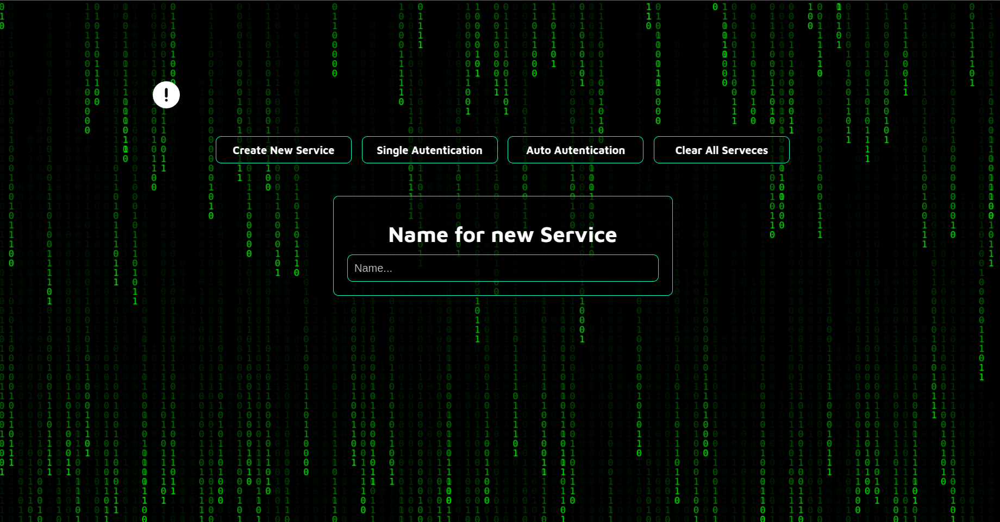
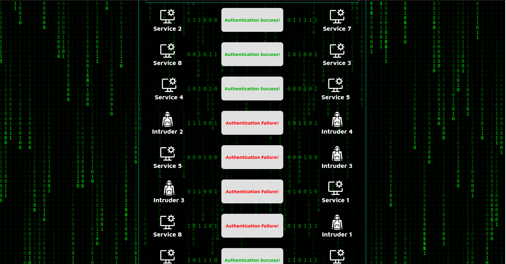

🔐 Autenticação Mútua – Demo com FastAPI e React

Este projeto é uma prova de conceito que demonstra a autenticação mútua entre serviços usando hashes compartilhados.
O objetivo é ilustrar como dois serviços legítimos podem se autenticar entre si, enquanto intrusos sem a chave correta falham na autenticação.

🚀 Arquitetura do Projeto

Backend (FastAPI - Python)

Implementa serviços que tentam se autenticar mutuamente.

Serviços legítimos compartilham uma chave conhecida.

Intrusos não possuem a chave correta e falham na autenticação.

Expõe endpoints REST para o frontend.

Frontend (React + TypeScript)

Interface para visualizar os resultados das tentativas de autenticação.

Mostra quais serviços conseguiram autenticar-se e quais falharam.

Consome os endpoints do backend.

Docker Compose

Orquestra os containers do backend e do frontend.

Facilita a execução do projeto completo com um único comando.

⚙️ Como Rodar com Docker Compose

Certifique-se de ter o Docker e o Docker Compose instalados.
Na raiz do projeto, execute:

docker-compose up --build

Isso irá:

Subir o backend FastAPI na porta 8000.

Subir o frontend React na porta 5173.

Acesse no navegador:
👉 http://localhost:5173

🛠️ Rodando Manualmente (sem Docker)
1. Backend (FastAPI - Python)

Dentro da pasta backend/:

python3 -m venv venv
source venv/bin/activate  # Linux/Mac
venv\Scripts\activate     # Windows

pip install -r requirements.txt
uvicorn facade:app --reload --host 0.0.0.0 --port 8000

Backend disponível em: http://localhost:8000

2. Frontend (React + TypeScript)

Dentro da pasta frontend/:

npm install
npm start

Frontend disponível em: http://localhost:3000

🔑 Conceito da Autenticação Mútua

Cada serviço possui uma chave conhecida pelos participantes legítimos.

Quando dois serviços se comunicam, ambos validam o hash recebido.

Caso o hash não corresponda (no caso de intrusos), a autenticação falha.

O fluxo pode ser visualizado pelo frontend, mostrando o resultado das tentativas de autenticação.

📌 Tecnologias Utilizadas

Backend: Python, FastAPI, Uvicorn

Frontend: React, TypeScript

Infraestrutura: Docker, Docker Compose

🧪 Próximos Passos / Extensões

Adicionar logs das tentativas de autenticação.

Fazer uma variante usando uma entidade certificadora.

Pré-Vizualização:

